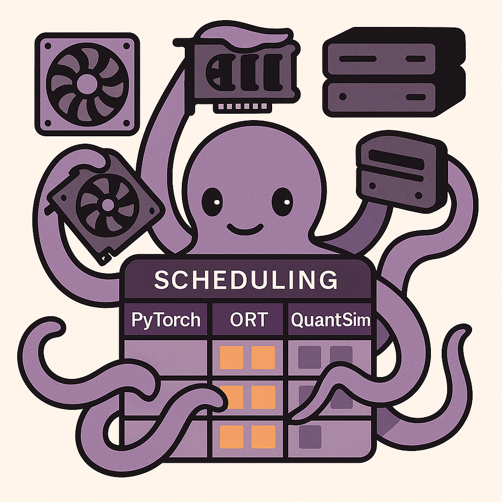

# Octopus — How Parallelism Works



Octopus wraps a single `for` loop and spreads it across multiple GPU workers automatically.

---

## The Core Idea

```
Your code                        What Octopus does
────────────────────────────     ──────────────────────────────────────────────
for x in inputs:                 ┌─────────────────────────────────────────┐
    result = model(x)            │              Octopus pool                │
                                 │  Worker 0 (GPU 0)  Worker 1 (GPU 1) ...  │
                                 │  model copy        model copy            │
                                 │      ↑                  ↑                │
                                 │  submit(x[0])       submit(x[1])         │
                                 │  submit(x[2])       submit(x[3])         │
                                 │       ...               ...              │
                                 └─────────────────────────────────────────┘
                                 results = gather()   ← ordered, all done
```

---

## Flow A — One Replica Per GPU

`workers_per_gpu=1` places exactly one model copy on each usable GPU.
Best when each GPU can hold the full model and you want maximum isolation.

```
GPU 0          GPU 1          GPU 2          GPU 3
┌──────────┐   ┌──────────┐   ┌──────────┐   ┌──────────┐
│ model[0] │   │ model[1] │   │ model[2] │   │ model[3] │
│          │   │          │   │          │   │          │
│ batch 0  │   │ batch 1  │   │ batch 2  │   │ batch 3  │
│ batch 4  │   │ batch 5  │   │ batch 6  │   │ batch 7  │
│  ...     │   │  ...     │   │  ...     │   │  ...     │
└──────────┘   └──────────┘   └──────────┘   └──────────┘
```

```python
with Octopus(model=model, eval_fn=eval_fn, workers_per_gpu=1) as o:
    results = o.map(inputs)
```

---

## Flow B — Pack Workers by VRAM

Omit `workers_per_gpu` and Octopus profiles VRAM usage, then packs as many
replicas per GPU as free memory allows.

```
GPU 0                       GPU 1
┌───────────────────────┐   ┌───────────────────────┐
│ worker A │ worker B   │   │ worker C │ worker D   │
│ model    │ model      │   │ model    │ model      │
│ [2 GB]   │ [2 GB]     │   │ [2 GB]   │ [2 GB]     │
│          ↑ 1 GB free  │   │          ↑ 1 GB free  │
└───────────────────────┘   └───────────────────────┘
  ← 8 GB GPU, safety_net_gb=1.0 →
```

```python
with Octopus(model=model, eval_fn=eval_fn) as o:        # auto-pack
    results = o.map(inputs)

with Octopus(model=model, eval_fn=eval_fn, max_workers=4) as o:   # cap at 4
    results = o.map(inputs)
```

---

## Pipeline Parallel (PP) — One Model Across N GPUs

For models too large for a single GPU, PP splits the layer graph into stages,
each stage living on a different GPU. Batches flow stage-by-stage.

```
Input batch
     │
     ▼
┌──────────┐     ┌──────────┐     ┌──────────┐
│  GPU 0   │ ──► │  GPU 1   │ ──► │  GPU 2   │
│ stage 0  │     │ stage 1  │     │ stage 2  │
│ layers   │     │ layers   │     │ layers   │
│  0–5     │     │  6–11    │     │  12–17   │
└──────────┘     └──────────┘     └──────────┘
                                       │
                                       ▼
                                   Output
```

Multiple PP shard-groups run in parallel for higher throughput:

```
Shard group 0:  GPU 0 → GPU 1          (batch A)
Shard group 1:  GPU 2 → GPU 3          (batch B)
```

```python
# PyTorch PP
with Octopus(model=model, eval_fn=eval_fn, sharding_strategy="pp", gpu_ids=[0, 1]) as o:
    results = o.map(batches)

# ONNX Runtime PP
with Octopus(model="/path/model.onnx", eval_fn=eval_fn, sharding_strategy="pp", gpu_ids=[0, 1]) as o:
    results = o.map(feed_dicts)
```

---

## Tensor Parallel (TP) — Weight Shards Across GPUs

TP splits weight matrices column-wise across GPUs. Each GPU holds a slice,
computes a partial result, then an all-reduce assembles the full output.
Best for large `nn.Linear` stacks with NVLink (fast interconnect).

```
Without TP (1 GPU):
┌─────────────────────┐
│  GPU 0              │
│  W: [4096 × 16384]  │   256 MB VRAM
└─────────────────────┘

With TP (4 GPUs, column-split):
┌────────────────┐  ┌────────────────┐  ┌────────────────┐  ┌────────────────┐
│  GPU 0         │  │  GPU 1         │  │  GPU 2         │  │  GPU 3         │
│  W: [4096×4096]│  │  W: [4096×4096]│  │  W: [4096×4096]│  │  W: [4096×4096]│
│  64 MB VRAM    │  │  64 MB VRAM    │  │  64 MB VRAM    │  │  64 MB VRAM    │
└───────┬────────┘  └───────┬────────┘  └───────┬────────┘  └───────┬────────┘
        └───────────────────┴───────────────────┴───────────────────┘
                                   all-reduce → full output
```

```python
# PyTorch TP (nn.Sequential linear stacks)
with Octopus(model=model, eval_fn=eval_fn, sharding_strategy="tp", gpu_ids=[0, 1, 2, 3]) as o:
    results = o.map(batches)
```

> **Note:** TP is PyTorch-only and scoped to `nn.Sequential` linear stacks.
> Use `sharding_strategy="pp"` for other architectures and all ONNX-family models.

---

## PP vs TP at a Glance

| | Pipeline Parallel (`pp`) | Tensor Parallel (`tp`) |
|---|---|---|
| Split axis | **layers** (graph stages) | **weights** (column/row split) |
| Backends | PyTorch, ONNX Runtime, AIMET ONNX | PyTorch only |
| Batch flow | stage 0 → stage 1 → … | all GPUs in parallel + all-reduce |
| Interconnect | PCIe OK (small activations) | NVLink preferred (all-reduce) |
| Best for | deep models, any architecture | wide linear layers, NVLink clusters |

---

## Scheduling

### Static (default)
Batches are pre-partitioned round-robin across workers.

```
workers:  W0   W1   W2   W3
batches:  b0   b1   b2   b3
          b4   b5   b6   b7
```

### Dynamic (work-stealing)
A background thread monitors free VRAM every 10 s. Workers that finish early
steal pending batches from the queue.

```python
Octopus(..., scheduling="dynamic")
```

---

## VRAM Profiling

Before spawning workers, Octopus dry-runs one forward pass to measure peak VRAM,
then computes how many workers fit per GPU with a configurable headroom:

```
free VRAM per GPU
─────────────────  =  workers per GPU  (capped by max_workers)
model VRAM + safety_net_gb
```

```python
Octopus(..., safety_net_gb=1.5)   # reserve 1.5 GB headroom per GPU
```
